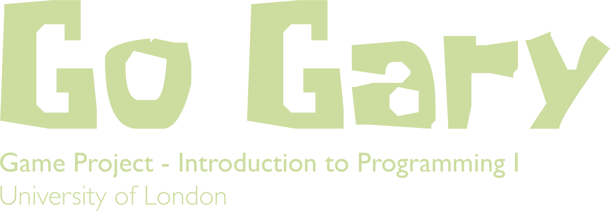
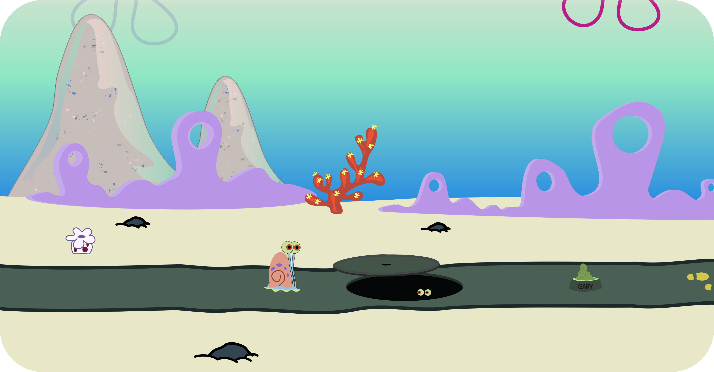

# Go Gary - A UoL Game Project

 

 

## Background

**Garold "Gary" Wilson**, Jr. is SpongeBob SquarePants' pet sea snail and the most seen pet in the series. He lives with
SpongeBob in his pineapple house on 124 Conch Street. ([reference](https://spongebob.fandom.com/wiki/Gary_the_Snail)).

Gary lives in **Bikini Bottom**, which is the main setting in the SpongeBob SquarePants series. It is an undersea city
where SpongeBob and his friends live. ([reference](https://spongebob.fandom.com/wiki/Bikini_Bottom)).

Go Gary is a game where Gary tries to eat food and avoids eating rotten food, and falling into manholes.

## Technical Details

### 1. Languages, Libraries and Tools

Initially I used `javascript` , but after the midterm submission the code was missy and full of bugs mainly because I
couldn't ensure type-safety of objects, so I rewrote a big part of the project in `typescript` to overcome the
previously mentioned obstacle, and to safely implement Object-Oriented Programming.

The game rely on the `p5js` library for manipulating the canvas.

I used `Git` VSC to manage the creation of every feature and to maintain a working version on the `master` branch.

### 2. Features highlights

* MVC pattern: To satisfy the SOLID principles.
* Random scenery: The creation of scenery objects is completely random. Once the page is reloaded, the scene will be
  changed.
* 2d perspective : All Scenery objects move in different speeds based on their distance from the scene camera.
* Buffered renderer: To avoid off-screen drawing and improve the game performance.
* Full-Screen mode: The game scene takes all the window size. (A page reload might be required to adapt the window size)
* Pixel density slider: When in fullscreen mode, the game lags on retina displays due to heavy graphics, but the pixel
  density can be changed using the top right slider to allow for smother experience.
* Singleton pattern: Implemented for views and controllers.
* Strategy pattern: Implemented for most of the models.
* Clean code: Almost all the classes in the project follow the same pattern. I also strove to give meaningful names to
  variables and functions.

### 3. Guide to exploring the project

#### The sketch file

1. Font and sounds are loaded inside `preload()`.
2. Pixel density slider is created inside `setup()`.
3. Scenery objects "views" singletons are created once and drawn inside `draw()`.
4. An instance of `Animator` is created once, and then animation logic is called.

#### A model

1. Holds static default values such as default sizes and colors.
2. Has a constructor to create objects.
3. Extends `MovableSceneryModel`. (Exceptions: sky rays models and ground models)

#### A controller

1. Singleton class.
2. Generates random models.
3. Responsible for changing the underlying values of models.
4. Responsible for storing models.
5. Extends `MovableSceneryModelsController<T>`. (Exceptions: sky rays controller and ground controller)

#### A view

1. scenery object
    1. Singleton class.
    2. Knows the drawing area of models.
    3. Calls the corresponding `controller` to generate `model`s inside the private constructor.
    4. Calls `p5js` framework specific commands.
    5. Does the actual drawing of the objects for each `model`.
2. animator
    1. Singleton class.
    2. Listens for, and responds to user key-presses.
    3. Verifies game logic by checking for game over status.
    4. Forces gravity on character.
    5. Animates food movement.
    6. Checks and responds to food collection.
    7. Checks and responds to character falling into manhole behavior.
    8. Animates scary eyes inside the manhole.
    9. Resets the game when the user wants to play again.
3. buffered renderer
    1. Singleton class.
    2. Exposes a generic method that returns only the models currently in the screen bounds plus a small buffer.
4. sketch
    1. Fonts and sounds are loaded inside `preload()`.
    2. Pixel density slider is created inside `setup()`.
    3. Scenery objects "views" singletons are created once and drawn inside `draw()`.
    4. An instance of `Animator` is created once, and then animation logic is called.

